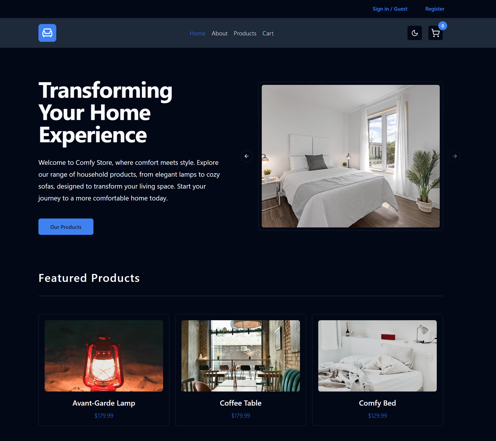
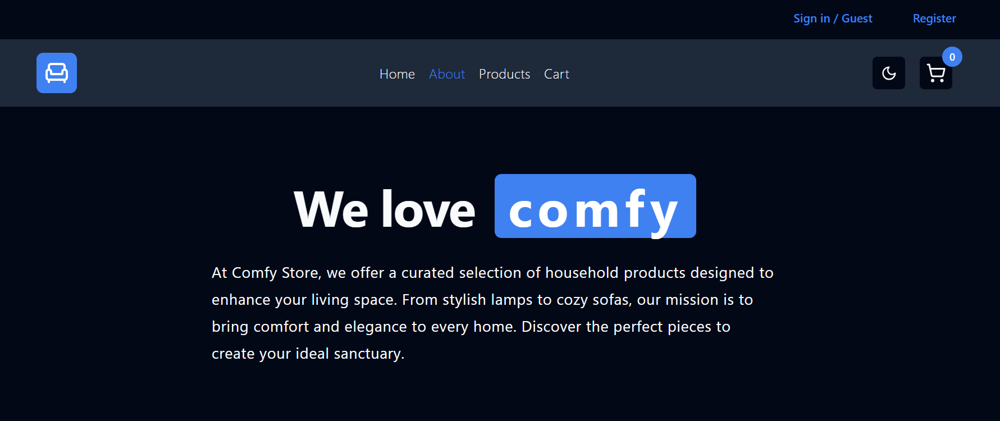
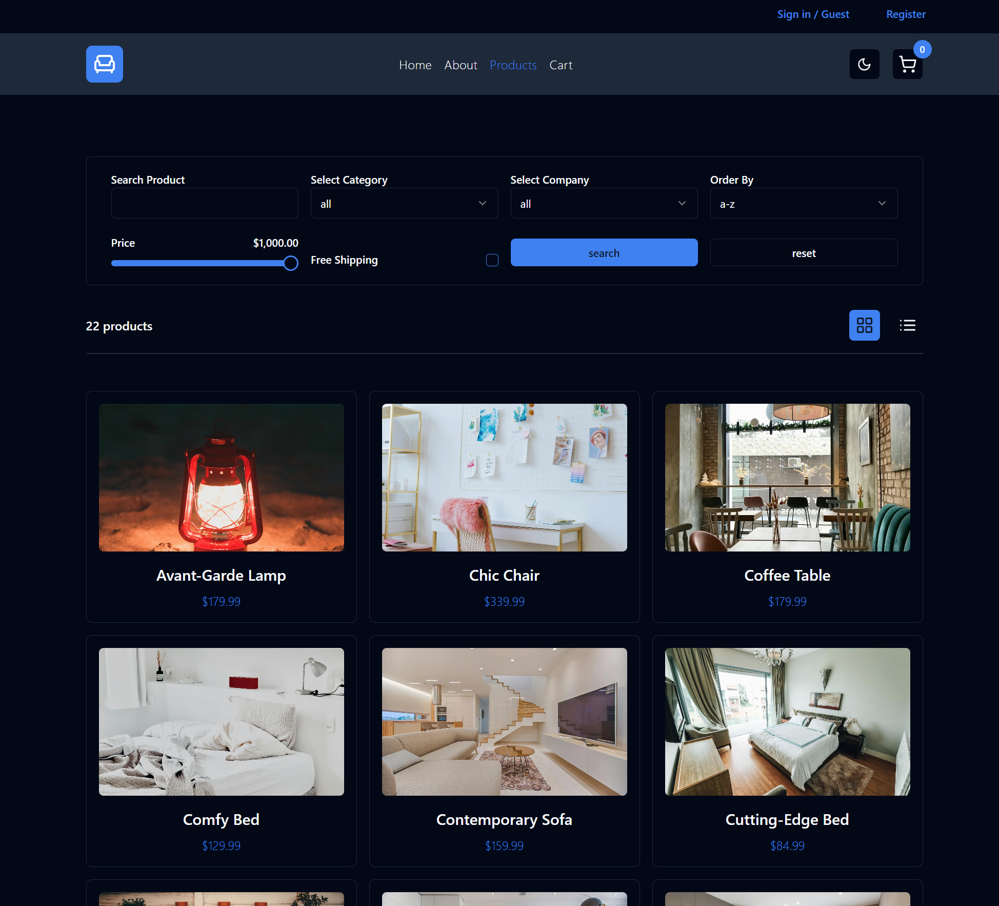
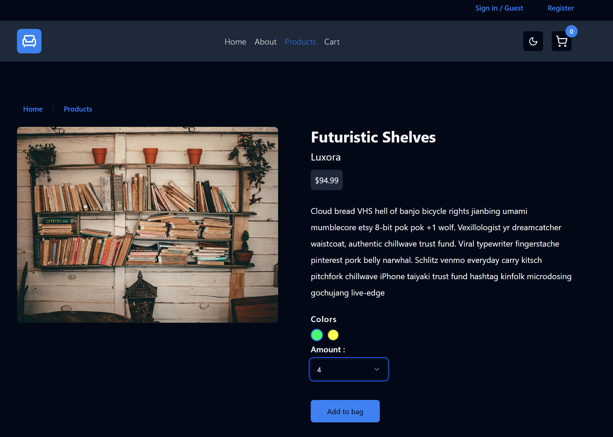
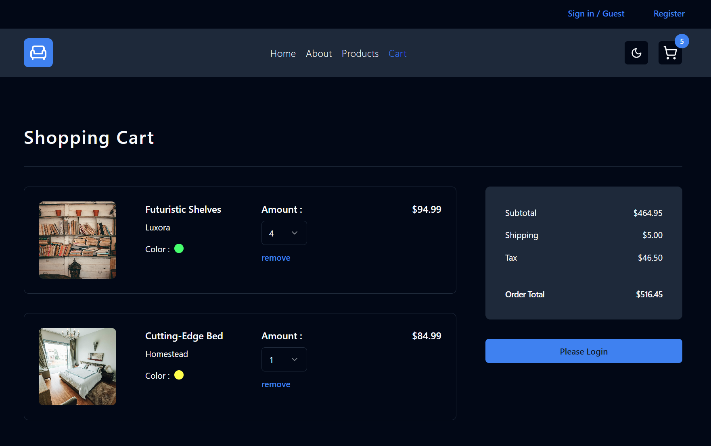
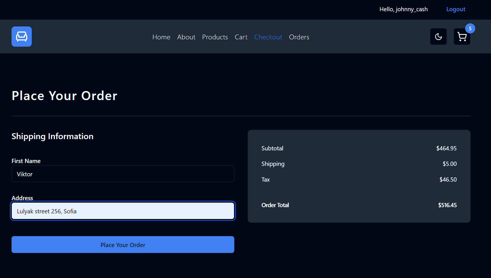
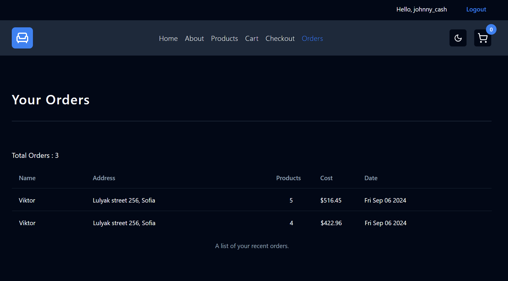

# My Comfy Store

**Disclaimer**: This project is based on the "Comfy Store" project from John Smilga's [Practical TypeScript Course](https://www.udemy.com/course/practical-typescript/?kw=practical+typescript&src=sac). The primary purpose of this repository is for personal learning and practice. All credit for the original design and concepts goes to John Smilga. This repository serves as my implementation of the project following the course.

## Overview
Welcome to the Comfy Store app! This app allows users to browse and purchase household products with ease.

## Technologies Used
- TypeScript
- React
- Redux
- HTML
- Tailwind CSS
- Shadcn/ui
- ESLint
- git

## How to Run the Project
1. Install the packages
```
npm install
```
2. Run the application
```
npm run dev
```


### Usage

## Public part

- **Home & About pages**
<br />On the Home page, the user could explore a curated selection of household products, including featured items and a convenient button to view all products. The About page gives a short description of Comfy Store.

<br />

- **Products page**
<br />The Comfy Store Products Page offers a comprehensive and user-friendly interface for browsing a wide range of household items. The page features an intuitive search bar that allows users to easily find products by various criteria such as price, alphabetical order, and category. Users can also arrange the products in two different viewing styles for a personalized shopping experience. Each product is displayed in a comfortable and accessible manner, ensuring a seamless and enjoyable browsing experience.


- **Single product view**
<br />The Single Product View Page in Comfy Store provides users with an in-depth look at each item. When a user clicks on a product, they are redirected to this page, where they can see detailed information about the item. Users have the option to select their preferred color and quantity before adding the product to their shopping bag. The intuitive design ensures a seamless and enjoyable shopping experience.


- **Shopping cart**
<br />The Shopping Cart Page in Comfy Store provides users with a clear and organized view of their selected items. On this page, users can see all the products they have added to their cart, along with the option to adjust the quantity or remove items as needed. The page also displays the total price of the order. With its user-friendly design, the Shopping Cart Page makes managing purchases simple and efficient, enhancing the overall shopping experience.


## Private part

- **Checkout Page**
<br />The Checkout Page in the Comfy Store App is accessible only to registered and logged-in users. On this page, users can finalize their purchases by providing their name and address. The page is designed to ensure a smooth and secure checkout process, guiding users through each step to place their order efficiently. With its clear layout and intuitive design, the Checkout Page makes completing a purchase quick and hassle-free.


- **Orders Page**
<br />The Orders Page is also exclusive to registered and logged-in users. This page provides a comprehensive and user-friendly list of all the user’s past orders, including detailed information about each purchase. Users can easily review their order history and access important details such as order dates, items purchased, and delivery information. The Orders Page ensures that users have all the information they need at their fingertips, enhancing their overall shopping experience.

